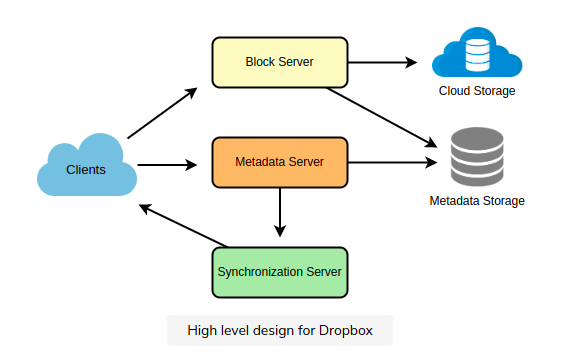

1. Why Cloud Storage?
   Cloud file storage services have become very popular recently as they simplify the storage and exchange of digital resources among multiple devices. This shift from using single personal computers to using multiple devices with different platforms and operation systems such as smartphones and tablets each with portable access from various geographical location at any time, is believed to be accountable for the huge popularity of cloud storage services. Following are some of the top benefits of such services:
   **Availability:** The motto of cloud storage services is to have data availability anywhere, anytime. Users can access their files/photos from any devices whenever and whereever they like.
   **Reliability and Durability:** Another benefit of cloud storage is that is offers 100% reliability and durability of data. Cloud storage ensures that user will never lose their data by keeping multiple copies of the data stored on different geographically located servers.
   **Scalability:** User will never have to worry about getting out of storage space. With cloud storage you have limited storage as long as you are ready to pay for it.
   
2. Requirements and Goals of the System
   What do we wish to achieve from a Cloud storage system? Here are the top-level requirements for our system:
   1. Users should be able to upload and download their files/photos from any devices.
   2. Users should be able to share files or folders with other users.
   3. Our service should support automatic synchronization between devices, i.e., after updating a file on one device, it should get synchronized on all devices.
   4. The system should support storing large files up to a GB.
   5. ACID-ity is required. Atomicity, Consistency, Isolation and Durability of all file operations should be guaranteed.
   6. Our system should support offline editing. Users should be able to add/delete/modify files while offline, and as soon as they come online, all their changes should be synced to the remote servers and other online devices.
   Extended Requirements
      1. The system should support snapshotting of the data, so that users can go back to any version of the files.
3. Some Design Considerations
   1. We should expect huge read and write volumes.
   2. Read to write ratio is expected to be nearly the same
   3. **Internally files can be stored in small parts or chunks(say 4MB); this can provide a lot of benefits** i.e. all failed operations shall only be retried for smaller parts of a file. If a user fails to upload a file, then only the failing chunk will be retried.
   4. We can reduce the amount of data exchange by transferring updated chunks only.
   5. By removing duplicate chunks, we can save storage space and bandwidth usage.
   6. Keeping a local copy of the metadata with the client can save us a lot of round trips to the server.
   7. For small changes, clients can intelligently upload the diffs instead of the whole chunk.
4. Capacity Estimation and Constraints
   
   * Let's assume that we have 500M total users, and 100M daily active user(DAU).
   * Let's assume that on average each user connects from three different devices.
   * On average if a user has 200 files/photos, we will have 100 billion total files.
   * Let's assume that average file size is 100KB, this would give is ten petabytes of total storage.
         100B * 100KB => 10PB
   * Let's also assume that we will have one million active connections per minute.
   
5. High Level Design
   
   The user will specify a folder as the workspace on their device. Any file/photo/folder places in this folder will be uploaded to the cloud, and whenever a file is modified or deleted, it will be reflected in the same way in the cloud storage. The user can specify similar workspaces on all their devices and any modification done on one device will be propagated to all other devices to have the same view of the workspace everywhere.
   
   At a high level, we need to store files and their metadata information like File Name, File Size, Directory, etc., and who this file is shared with. So we need some servers that can help the client to upload/download files to Cloud Storage and some servers that can facilitate updating metadata about files and users. We also need some mechanism to notify all clients whenever an update happens so they can synchronize their files.

   As shown in the diagram below, **Block servers will work with the clients to upload/download files from the cloud storage** and **Metadata services will keep metadata of the files updates in a SQL or NoSQL database. Synchronization servers will handle the workflow of notifying all clients about different change for synchronization.**
   
   

6. Component Design
   1. Client
   2. Metadata Database
   3. Synchronization Service
   4. Message Queuing Service
   5. Cloud/Block Storage
7. File Processing Workflow
8. Data Deduplication
9. Metadata Partitioning
10. Caching
11. Load Balancer (LB)
12. Security, Permissions and File Sharing