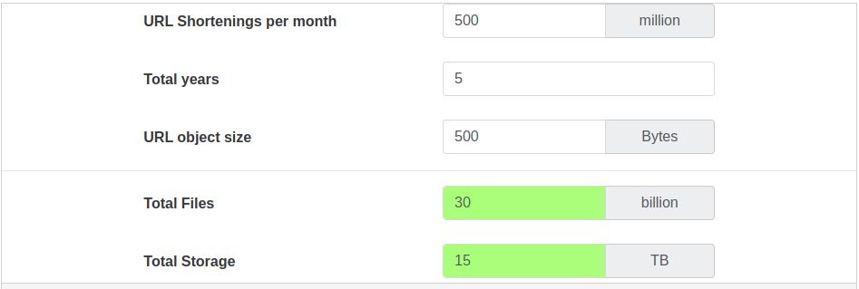

**Functional Requirements:**

1. Given a URL, our service should generate a shorter and unique alias of it. This is called short link. This link should be short enough to be easily copied and pasted into applications.
2. When users access a short link, our service should redirect them to the original link.
3. Users should optionally be able to pick a custom short link for their URL.
4. Links will expire after a standard default timespan. Users should be able to specify the expiration time.

**Non-Functional Requirements:** 

1. The system should be highly **available**. This is required because, if our service is down, all the URL redirection will start failing.
2. URL redirection should happen in real-time with minimal **latency**.
3. Shortened link should not be guessable.

**Extended Requirements:**

1. Analytics; e.g., how many times a redirection happened?
2. Our service should also be accessible through REST APIs by other services.

**Capacity Estimation and Constraints:** Our system will be **read-heavy**. There will be lots of redirection requests compared to new URL shortenings. Let's assume a 100:1 ratio between read and write.

**Traffic estimates:** Assuming, we will have 500M new URL shortenings per month, with 100:1 read/write ratio, we can expect 50B redirections during the same period:

        100 * 500M => 50B

What would be Queries Per Second(QPS) for our system? New URLs shortening per second:

        500M / (30D * 24H * 3600S) = ~200URLs/s.

Considering 100:1 read/write ratio, URLs redirections per second will be:

        100 * 200URLs/s = 20K/s

**Storage estimates:** Let's assume we store every URL shortening request for 5 years. Since we expect to have 500M new URLs every month, the total number of objects we expect to store will be 30 billion:

        500M * 5Y * 12M = 30B

Let's assume that each stored object will be approximately 500 bytes. We will need 15TB of total storage:

        30B * 500 bytes = 15TB

In the following table, we can change our assumptions to see how the estimates change:

**Bandwidth estimates:** For write requests, since we expect 200 new URLs every second, total incoming data for our service 100KB per second

        200 * 500 bytes = 100KB/s

For read requests, since every second we expect ~20K URLs

        20K * 500 bytes = ~10MB/s

**Memory estimates:** If we want to cache of the hot URLs that are frequently accessed, how much memory will we need to store them? If we follow the 80-20 rule, meaning 20% of the URLs generate 80% of traffic, we would like to cache there 20% hot URLs.

Since we have 20K requests per second, we will be getting 1.7 billion requests per day:

        20K * 3600 seconds * 24 hours = ~1.7 billion

To cache 20% of these requests, we will need 170GB of memory.

        0.2 * 1.7 billion * 500 bytes = ~170GB

One thing to note here is that since there will be many duplicate request, our actual memory usage will be less than 170GB.

**High level estimates:** Assuming 500 million new URLs per month 100:1 read:write ratio, the following is the summary of the high level estimates for our service:

| Types of URLs       | Time Estimates |
|---------------------|----------------|
| New URLs            | 200/s          |
| URL redirections    | 20 k/s         |
| Incoming data       | 100KB/s        |
| Outgoing data       | 10MB/s         |
| Storage for 5 years | 15TB           |
| Memory for cache    | 170GB          |

**System APIs:**

We can have SOAP or REST APIs to expose the functionality of our service. Following could be definitions of the APIs for creating and deleting URLs:

        createURL(api_dev_key, original_url, custom_alias=None, user_name=None, expire_date=None)

**Parameters:** 

* api_dev_key(string): The API developer key of a registered account. This will be used to, amount other things, throttle user based on their allocated quota.
* original_url(string): Original URL to be shortened.
* custom_alias(string): **Optional** custom key for the URL.
* user_name(string): **Optional** username to be used in the encoding.
* expire_date(string): **Optional** expiration date for the shortened URL.

**Returns:(string)**

A successful insertion returns the shortened URL; otherwise, it returns an error code.

        deleteURL(api_dev_key, url_key)

where "url_key" is a string representing the shortened URL to be retrieved; a successful deletion returns `URL Removed`.

**How do we detect and prevent abuse?** A malicious user can put us out of business by consuming all URL keys in the current design. To prevent abuse, we can limit users via their api_dev_key. Each `api_dev_key` can be limited to a certain number of URL creations and redirections per some time period(which may be set to a different duration per developer key)

**5. Database Design:**

A few observations about the nature of the data we will store:

1. We need to store billions of records.
2. Each object we store is small(less than 1K).
3. There are no relationships between records-other than storing which user created a URL.
4. Our service is read-heavy.

**Database schema:**

We would need two tables: one fore storing information about the URL mappings and one for the user's data who created the short link.

| URL |                          |
|-----|--------------------------|
| PK  | Hash: varchar(16)        |
|     | OriginalURL: varchar     |
|     | CreationDate: datetime   |
|     | ExpirationDate: datetime |
|     | UserId: int              |

| User  |                        |
|-------|------------------------|
| PK    | UserID: int            |
|       | Name: varchar          |
|       | Email: datetime        |
|       | CreationDate: datetime |
|       | LastLogin: int         |

What kind of database should we user? Since we anticipate storing billions of rows, and we don't need to use relationship between objects - a NoSQL store like DynamoDB, Cassandra or Riak is a better choice. A NoSQL choice would also be easier to scale. 

**6. Basic System Design and Algorithm:**

In the TinyURL example in Section 1, the shortened URL is “https://tinyurl.com/rxcsyr3r”. The last eight characters of this URL constitute the short key we want to generate. We'll explore two solutions here:

**a. Encoding actual URL:** We can compute a unique hash(e.g. MD5 or SHA256 etc.) of the given URL. The hash can be then encoded for display. This encoding could be base36([a-z, 0-9]) or base62([A-Z, a-z, 0-9]) and if we add `+` or `/` we can use Base64 encoding. A reasonable question would be what should be length of the short key? 6, 8, or 10 characters?

Using base64 encoding, a letters long key would result in 
    
        64 ^ 6 = ~68.7 billion possible strings.

Using base64 encoding, an 8 letters long key would result in 

        64 ^ 8 = ~281 trillion possible string.

With 68.7 unique strings, let's assume six letter keys would suffice for our system.

If we use the MD5 algorithm as our hash function, it will produce a 128-bit hash value. After base64 encoding, we'll get a string having more than 21 character(since each base64 character encodes 6 bits of the hash value). Now we only have space for 6 (or 8) characters per short key; how will we choose out key then? We can take the first 6 (or 8) letters for the key. This could result in key duplication; to resolve that, we can choose some other characters out of the encoding string or swap some characters.

.... some blah blah which I don't understand.

**b. Generating keys offline:** We can have a standalone **Key Generation Service(KGS)** that generates random six-letter strings beforehand and stores them in a database(let's call it key-DB). Whenever we want to shorten a URL, we will one of the already generated keys and use it. This approach will make things quite simple and fast. Not only are we no encoding the URL, but we won't have to worry about duplications or collisions. **KGS** will make sure all the keys inserted inot the key-DB are unique.

**Can concurrency cause problems?** As soon as a key is used, it should be marked in the database to ensure that it is not used again. If there are multiple servers reading keys concurrently, we might get a scenario where two or more servers try to read the same key from the database. How can we solve this concurrency problem?

Servers can use KGS to read/mark keys in the database. KGS can use two tables to store keys; one fore key that are not used yet and one for all the used keys. As soon as KGS gives keys to one of the servers, it can move them to the used keys table. KGS can always keep some keys in memory to quickly provide them whenever a server needs them.

For simplicity, as soon as KGS loads some keys in memory, it can move to the used keys table. This ensures each server gets unique keys. If KGS dies before assigning all the loaded keys to some servers, we will be wasting those key-which would be acceptable, given the huge number of keys we have.

KGS also has to make sure not to give the same key to multiple servers. For that, it must synchronize the datastructure holding the keys before removing keys from it and giving them to a server.

**What would be key-DB size?** With base64 encoding, we can generate 68.7B unique six letters keys. If we need one byte to store one alpha-numeric character, we can store all these keys in:

    6 * 68.7B = 412GB

**Isn't KGS a single point of failure?** Yes, it is. To solve this, we can have a standby replica of KGS. Whenever the primary server dies, the standby server can take over to generate and provide keys.

**Can each app server cache some keys from key-DB?** Yes, this can surely speed things up. Although, in this case, if the application server dies before consuming all the keys, we will end up losing those keys. This can be acceptable since we have 68B unique six-letter keys.

**How would we perform a key lookup?** We can look up the key in our database to get the full URL. If it's present in the DB, issue an "HTTP 302 redirect" status back to the browser, passing the stored URL in the "Location" field of the request. If that key is not present in our system, issue an "HTTP 404 Not Found" status or redirect the user back to the homepage.

**Should we impose size limits on custom aliases?** Out service supports custom aliases. Users can pick any `key` they like, but providing a custom alias is not mandatory. However, it is reasonable to impose a size limit on a custom alias to ensure we have a consistent URL database. Let's assume user can specify a maximum of 16 characters per customer key(as reflected in the above database schema).

**7. Data partitioning and Replication:** To scale out our DB, we need to partition it so that it can store information about billions of URLs. Therefore, we need to develop a partitioning scheme that would divide and store our data into different DB servers.

**a. Range Based Partitioning:** We can store URLs in separate partitions based on the hash key's first letter. Hence we will save all the URL hash keys starting with the letter `A`(and `a`) in one partition, save those that start with the letter `B` in another partittion and so on. This approach is called range-based partitioning. We can even combine certain less frequently occuring letters into one database partition. Thus, we should develop a static partitioning schema to always store/find a URL in a predictable manner.

The main problem with this approacj is that it can lead to unbalanced servers. For example we decide to put all URLs starting with the letter `E` inta a DB partition, but later we realize that we have too many URLs that start with the letter `E`.

**b. Hash-Based Partitioning:** In this scheme, we take a hash of the object we are storing. We then calculate which partition to use based upon the hash. In our case, we can take the hash of the `Key` or the short link to determine the partition in which we store the data object.

Our hashing function will randomly distribure URLs into different partitions. This number would represent the partition in which we store our object.

This approach can still lead to overloaded partitions, which can be solved using `Consistent Hashing`.

**8. Cache:** We can cache URLs that are frequently accessed. We can use any off-the-shelf solution like `Memcached`, which can store full URLs with their respective hashes. Thus, the application servers, before hitting the backend storage, can quickly check if the cache has the desired URL.

**How much cache memory should we have?** We can start with 20% of daily traffic and based on client's usage patterns, we can adjust how many cache servers we need. As estimated above, we need `170GB` of memory to cache `20%` of daily traffic. Since a modern-day server can have 256GB of memory, we can easily fit all the cache into one machine. Alternatively, we can use a couple of smaller servers to store all these hot URLs.

**Which cache eviction policy would best fit our needs?** When the cache is full, and we want to replace a link with a newer/hotter URL, how would we choose? **Least Recently Used** (LRU) can be a reasonable policy for our system. Under this policy, we discard the least recently used URL first. We can use a Linked Hash Map or a similar data structure to store our URLs and Hashes, which will also keep track of the URLs that have been accessed recently.

To further increase the efficiency, we can replicate our caching servers to distribute the load between them.

**How can each cache replica be updated?** Whenever there is a cache miss, our servers would be hitting a backend database. Whenever this happens, we can update the cache and pass the new entry to all the cache replicas. Each replica can update its cache by adding the new entry. If a replicate already has that entrym it can simply ignore it.

**Load Balancer:** We can add a Load balancing layer at three places in our system:
    
1. Between Clients and Application servers
2. Between Application servers and database server
3. Between Application server and Cache servers.

Initially, we could use a simple Round Robin approach that distributes incoming requests equally among backend servers. This LD is simple to implement and does not introduce any overhead. Another benefir of this approch is that if a server is dead, LB will take it out of the rotation and stop sending any traffic to it.

A problem with Round Robin LB is that we don't consider that server load. As a result, if a server is overloaded or slow, the LB will non stop sending new request to that server. To handle this, a more inteillgent LB solution can be placed that periodically queries the backend server about its load and adjusts traffic based on that.

**10. Purging or DB cleanup:** Shoud entries stick around forever, or should they be purged? If a user-specified expiration time is reached, what should happen to the link?

If we chose to continously search for expired links to remove them, it would put alot of pressure on our database. Instead we can slowly remove expired links and do a lazy cleanup. Our service will ensure that only expired links will be deleted, although some expired links can live longer but will never be returned to users.

1. Whenever a user tries to access an expired link, we can delete the link and return an error to the user.
2. A separate cleanup server can run periodically to remove expired links from storage and cache. This service should be very lightweight and scheduled to run only when the user traffic is expected to be low.
3. We can have a default expiration time for each link.
4. After removing an expired link, we can put the key back in the key-DB to be re-used.
5. Should we remove links that haven't been visited in some length of time, say six months? This could be tricky. Since storage is getting cheap, we can decide to keep links forever.

**Telemetry** How many times a short URL has been used, what were user locations, etc.? How would we store these statistics? If it is part of a DB row that gets updated on each view, what will happen when a popular URL is slammed with a large number of concurrent requests?

Some statistics worth tracking: country of the visitor, date and time of access, web page that referred the click, browser, or platform from where the page was accessed.

**12. Security and Permissions:** Can uses create private URLs or allow a particular set of uses to access a URL?

We can store the permission level(public/private) with each URL in the database. We can also create a separate table to store UserIDs that have permission to see a specific URL. If a user does not have permission and tries to access a URL, we can send an error back. Given that we are storing our data in a NoSQL wide-column database like Cassandra, the key for the table storing permission would be `Hash`. The columns will store the UserIDs of those users that have the permission to see the URL.